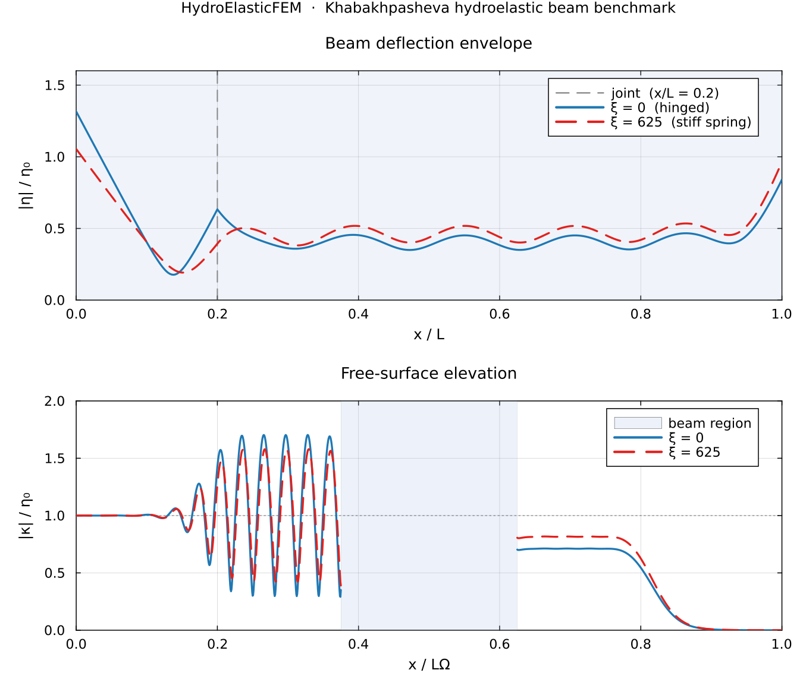

# HydroElasticFEM.jl

<div style="text-align: center; margin: 0 0 1.5rem;">
    
</div>

[![CI Status][ci-img]][ci-url]
[![Code Coverage][cov-img]][cov-url]
[![Documentation][docs-img]][docs-url]

[ci-img]: https://img.shields.io/github/actions/workflow/status/CMOE-TUDelft/HydroElasticFEM.jl/CI.yml?branch=main
[ci-url]: https://github.com/CMOE-TUDelft/HydroElasticFEM.jl/actions/workflows/CI.yml
[cov-img]: https://img.shields.io/codecov/c/github/CMOE-TUDelft/HydroElasticFEM.jl?branch=main
[cov-url]: https://codecov.io/gh/CMOE-TUDelft/HydroElasticFEM.jl
[docs-img]: https://img.shields.io/badge/docs-stable-blue.svg
[docs-url]: https://CMOE-TUDelft.github.io/HydroElasticFEM.jl/

**HydroElasticFEM.jl** is a Julia package for finite element (FE) simulation of hydro-elastic wave–structure interaction problems. It couples potential flow fluid models with structural models (membranes, Euler–Bernoulli beams, resonators) using the [Gridap.jl](https://github.com/gridap/Gridap.jl) FE framework.

## Package Features

- **Frequency-domain and time-domain simulations** – solve hydro-elastic problems in either domain
- **Modular and expandable physics entities** – `PotentialFlow`, `FreeSurface`, `Membrane`, `EulerBernoulliBeam`, `ResonatorSingle`
- **Automated multi-field FE space construction** – seamless assembly of coupled systems
- **Automatic differentiation support** – for nonlinear problems
- **Cartesian mesh generation** – with structure and damping-zone support (unstructured mesh under development)
- **Automatic coupling detection** – coupling terms identified automatically from physics entity traits

## Installation

HydroElasticFEM.jl is registered in the Julia General registry.
Install it with:

```julia
using Pkg
Pkg.add("HydroElasticFEM")
```

If you prefer to develop against the repository directly:

```julia
using Pkg
Pkg.develop(url="https://github.com/CMOE/HydroElasticFEM.jl")
```

## Quick Start

Here's a minimal example to get started with HydroElasticFEM.jl:

```julia
import HydroElasticFEM.Geometry as G
import HydroElasticFEM.ParameterHandler as PH
import HydroElasticFEM.Physics as P
import HydroElasticFEM.Simulation as S

# 1. Define the fluid domain (a 2D rectangular tank)
domain = G.TankDomain(L=10.0, H=1.0, nx=60, ny=8)

# 2. Define physics entities using defaults (ρw=1025, g=9.81, βₕ=0.5, …)
fluid   = P.PotentialFlow()
surface = P.FreeSurface()

# 3. Configure and run a frequency-domain simulation at ω = 1 rad/s
config  = PH.FreqDomainConfig(ω=1.0)
problem = S.build_problem(domain, P.PhysicsParameters[fluid, surface], config)
result  = S.simulate(problem)

# 4. Unpack the solution fields: velocity potential ϕ and free-surface elevation κ
phi_h, kappa_h = result.solution
```

For detailed examples, see the [examples/](examples/) directory.

## Validation Example: Hydroelastic Beam with Rotational Joint

The figure below shows the normalised beam deflection $|\eta|/\eta_0$ for two cases of the Khabakhpasheva benchmark (regular wave, $\alpha = \lambda/L_b = 0.249$, $kH \approx 2.22$), reproduced from Section 5.3 of [Colomés et al. (2023)](https://onlinelibrary.wiley.com/doi/full/10.1002/nme.7140):

- **ξ = 0** — hinged joint (zero rotational stiffness), the beam can rotate freely at the joint location $x/L = 0.2$
- **ξ = 625** — stiff rotational spring, limiting joint rotation

<div align="center">
  
</div>

The top panel shows the deflection envelope along the beam; the bottom panel shows the free-surface elevation $|\kappa|/\eta_0$ across the whole domain. Reproduced with `examples/KhabakhpashevaBeamJointExample.jl`:

```julia
include("examples/KhabakhpashevaBeamJointExample.jl")
using .KhabakhpashevaBeamJointExample
results = run_khabakhpasheva_two_cases()
```

## Documentation

Complete documentation is available at [https://CMOE.github.io/HydroElasticFEM.jl/](https://CMOE.github.io/HydroElasticFEM.jl/) with:

- **Getting Started** – installation and first simulation
- **Examples** – worked example scripts demonstrating various use cases
- **Theory** – governing equations and discretisation details
- **API Reference** – complete docstring reference for all modules and functions

## Contributing

Contributions are welcome! Please see [CONTRIBUTING.md](CONTRIBUTING.md) for guidelines on how to contribute.

## License

This project is licensed under the terms specified in [LICENSE.md](LICENSE.md).